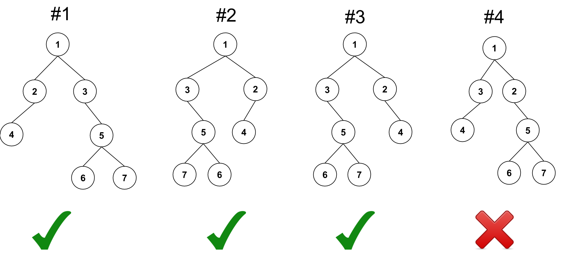

# HW 11 - Intro to Binary Search Trees

## Learning Goals
After doing this assignment, you should
* understand the structure of BSTs
* learn how to execute an in order traversal on a BST
* learn how to find the successor and predecessor of a node
* have explored properties of BSTs

## Resources

* Checkout our slides [here](https://drive.google.com/open?id=1wHJihTvzDzHhqqL8LJotUjiXVB8KUNBE8wF4zDV1zAc). These have some information on the pre-written functions
* MIT lecture notes [here](https://drive.google.com/open?id=1t1AzWW_1FeFpn8GSCRgGY2rPtw5zg_ws).

## Code

1. Implement the following methods in `BinarySearchTree.java`:
  * `public List<T> inOrderTraversal()` Performs an in-order traversal of the tree.  
    * How would you traverse the tree such that the smallest-key
      node is processed first, and the largest-key node is processed
      last?   

  * `public T findSuccessor(T key)` Finds the node immediately following `n` in the in-order traversal of the entire tree.
      * What if n has no successor? 
      * What if its successor is one of its descendants? 
      * What if its successor is one of its ancestors?  

  * `public T findPredecessor(T key)` Finds the node immediately preceding `n` in the in-order traversal of the entire tree
  Run corresponding tests in `BinarySearchTreeTest.java` to make sure your implementations are correct.
    * What if n has no predecessor? 
    * What if its predecessor is one of its descendants? 
    * What if its predecessor is one of its ancestors?  
2. What is the worst case runtime of `inOrderTraversal`, `findSuccessor` and `findPredecessor`? (think carefully)
3. Handle the third case of the `delete` function. If you remember from lecture, there are 3 cases:
  * Node has no children
  * Node has one child
  * Node has two children

## Visualization

1. Draw the binary search tree resulted from inserting the keys [20,10,15,12,18,11,14,16,19,13,17].
2. Explain to your NINJA the step by step process (by drawing) of these operations on your tree above, noting down all pointer changes at each step:
  * `delete(15)` then
  * `delete(10)` then
  * `delete(19)`

## Problems

Choose at least one of the following problems:

1. Given an unsorted array, create a binary search tree with minimal height. Implement this in `Problems.minimalHeight`.

Hint 1

Think about what element must be inserted first

Hint 2

Think about how you would use recursion

Hint 3

Think about binary search and how you may apply it

2. Two trees T1 and T2 are isomorphic if T1 can be transformed to T2 by swapping left and right children of (some of) the nodes in T1. Write a function that determines if two trees are isomorphic. You are given their root nodes. Implement this in `Problems.isIsomorphic`. In the image below, the first, second and third binary trees are isomorphic with each other, while the last is not since the children of node 2 and 3 were switched.

Hint 1

Try everything

Hint 2

Remember the the generic algorithm for BSTs? How can you tweak it to swap left and right children of different nodes?

Hint 3

If two tree are isomorphic, for each node in 1 of the trees there are 2 possibilities: the node's children are the same in the isomorphic version or they are switched. If we check for equality in both of these cases and one returns true, at least that node and its children are isomorphic (but what about the childrens' children?)

## Getting Checked Off
Talk to a NINJA with your working test cases and BST drawing. Make sure you are prepared to explain your high-level solution to the problems **without looking through your code**. Feel free to draw out the steps of your algorithm beforehand if you feel like it would help.
